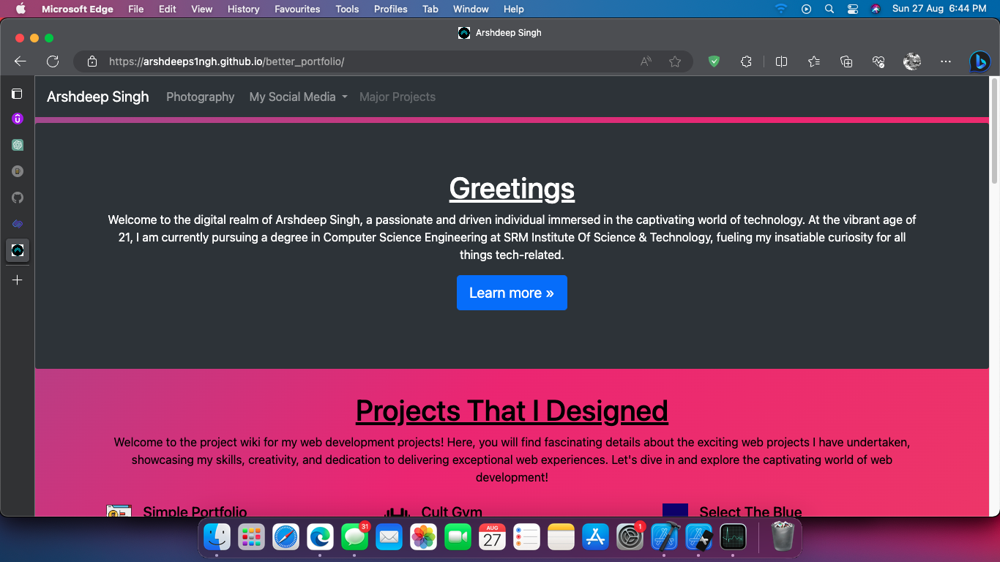

# My Portfolio Website

Welcome to my portfolio! I am thrilled to showcase my skills and accomplishments through this responsive website created using HTML, CSS, and JavaScript. With a visually appealing and user-friendly design, my portfolio adapts seamlessly to different screen sizes, ensuring an optimal viewing experience on desktops, laptops, tablets, and mobile devices. Organized into categories, my carefully curated projects demonstrate my versatility, technical expertise, and creative problem-solving. By incorporating interactive elements through JavaScript, I have made the portfolio engaging and dynamic, enabling visitors to explore and interact with the content. The elegant and professional visual design, achieved through CSS, reflects my aesthetic sensibilities, presenting a comprehensive snapshot of my journey, expertise, and achievements.

## Website Link

Visit my portfolio website [here](https://arshdeeps1ngh.github.io/better_portfolio/) to explore my projects and learn more about me.

## Preview

## Features

- Responsive design for optimal viewing on various devices.
- Categorized project showcase highlighting versatility.
- Interactive elements and animations powered by JavaScript.
- Elegant and professional visual design achieved through CSS.

## Technologies Used

- HTML
- CSS
- JavaScript

